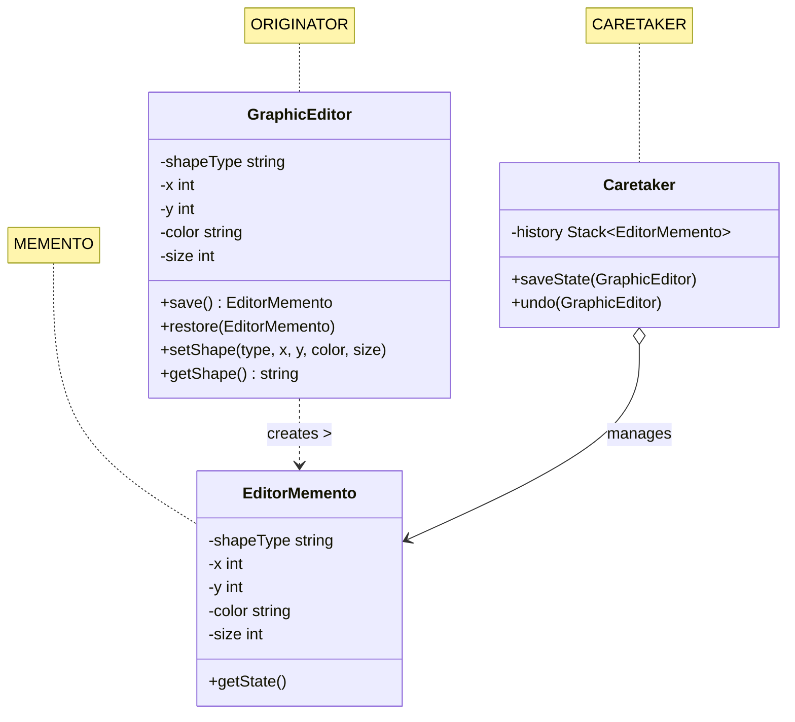
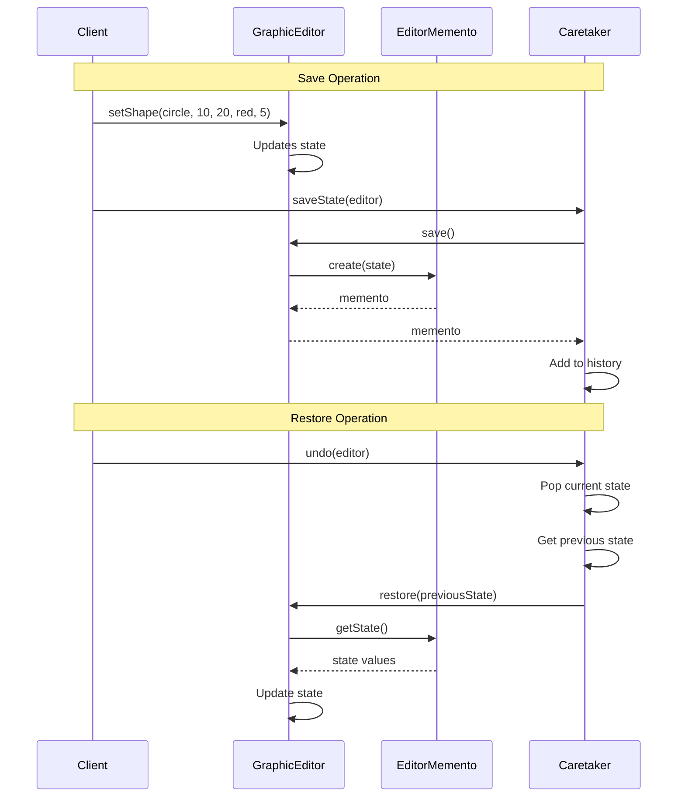

# Understanding the Memento Pattern

## Pattern Structure


## Sequence of Operations


## Components and Responsibilities

### 1. Originator (GraphicEditor)
- Contains the state that needs to be saved
- Creates mementos containing a snapshot of its current state
- Uses mementos to restore its state

### 2. Memento (EditorMemento)
- Stores the state of the Originator
- Provides immutable access to stored state
- Only Originator can access full state

### 3. Caretaker
- Keeps track of multiple mementos
- Never modifies mementos
- Manages when to save and restore Originator's state

## Example Usage

```go
    // Create the editor and caretaker
    editor := NewGraphicEditor()
    caretaker := NewCaretaker()

    // Example 1: Creating a circle
    fmt.Println("\n=== Creating Circle ===")
    editor.SetShape("circle", 10, 20, "red", 5)
    fmt.Println("Current State:", editor.GetShape())
    caretaker.SaveState(editor)
