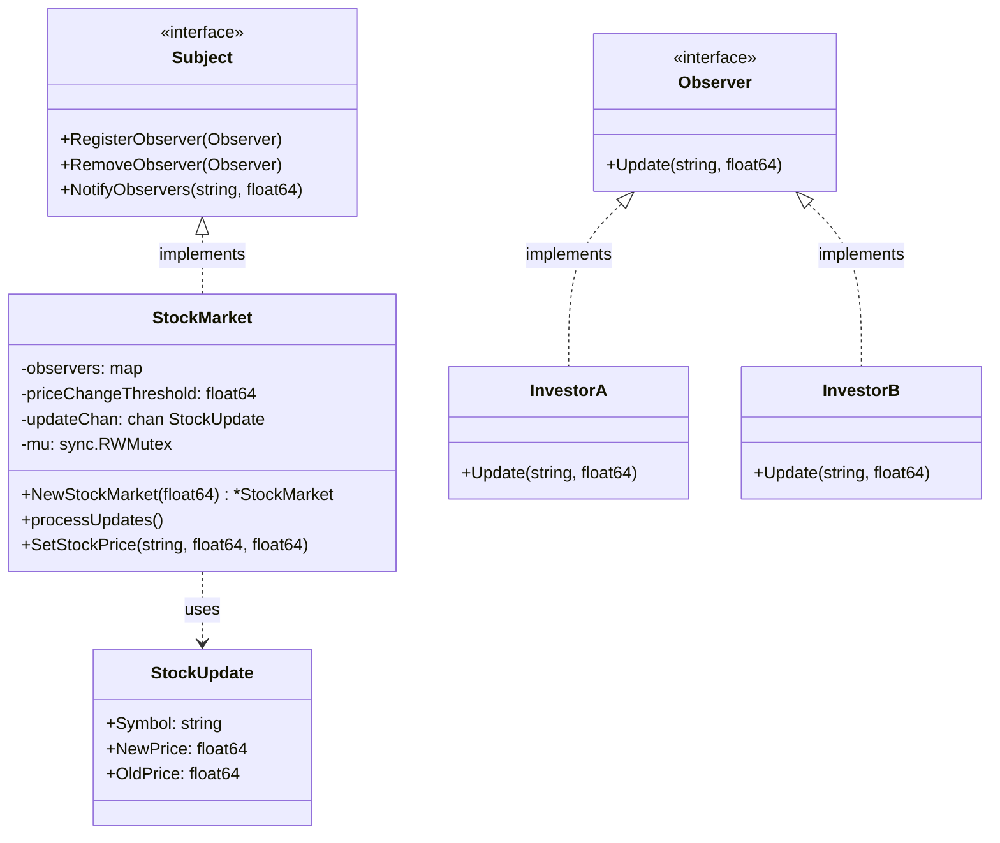

# Understanding the Observer Pattern

## Pattern Structure


## Sequence of Operations
```
flowchart TD
    A[Main Program] -->|Create| B[StockMarket]
    B -->|Start| C((processUpdates Goroutine))
    
    D[SetStockPrice] -->|Send Update| E[(updateChan)]
    E -->|Receive| C
    
    C -->|Threshold Check| F[NotifyObservers]
    F -->|Spawn Goroutines| G[WaitGroup]
    
    G -->|Concurrent Update| H[Observer A Goroutine]
    G -->|Concurrent Update| I[Observer B Goroutine]
    
    H -->|Complete| J[WaitGroup Done]
    I -->|Complete| J
    
    subgraph Synchronization
        K[RWMutex] -.->|Protects| L[Observers Map]
    end
```
