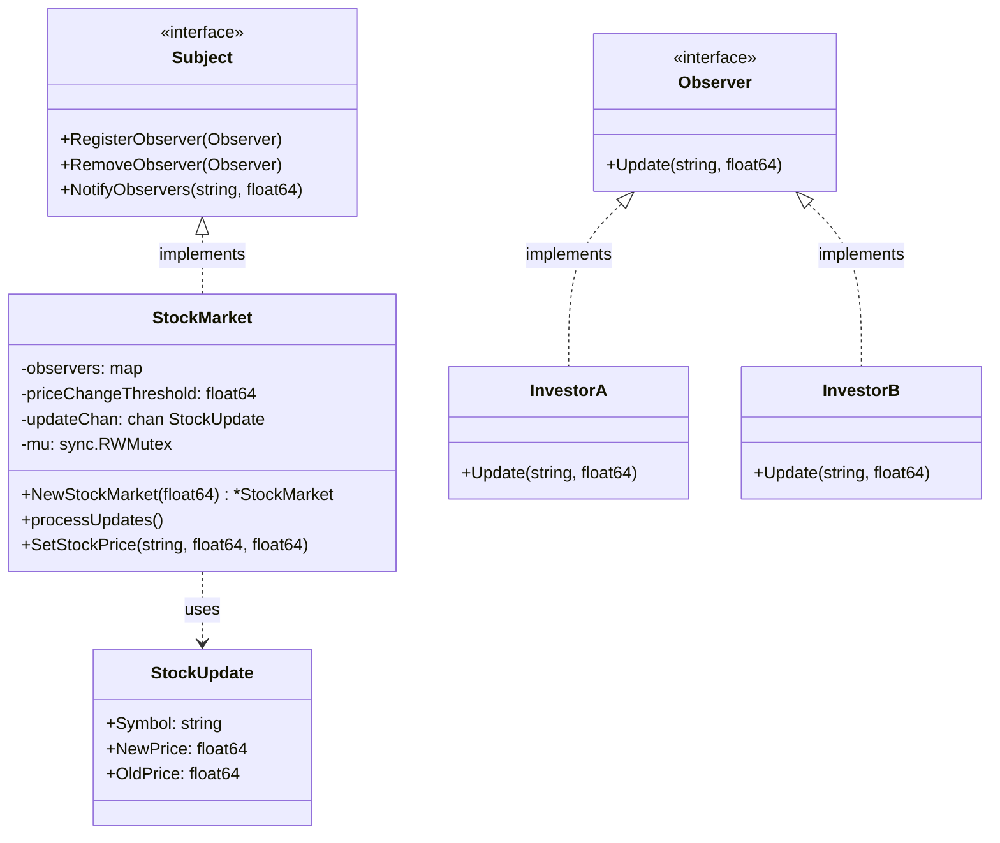
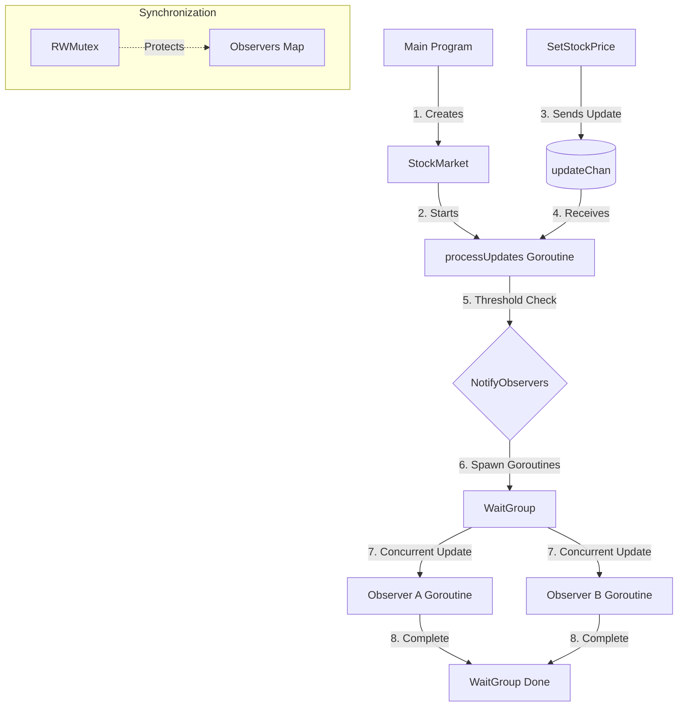

# Understanding the Observer Pattern

## Pattern Structure

## Sequence of Operations

## Implementation Details

### 1. Core Components
- **Subject Interface**: Defines the contract for managing observers
- **Observer Interface**: Defines the update method for receiving notifications
- **StockMarket**: Concrete implementation of the Subject interface
- **InvestorA/B**: Concrete implementations of the Observer interface

### 2. Concurrency Mechanisms
- **Channels**: `updateChan` buffers and processes stock updates asynchronously
- **Goroutines**: Used for concurrent notification of observers
- **WaitGroup**: Synchronizes completion of observer notifications
- **RWMutex**: Ensures thread-safe access to the observers map

### 3. Data Flow
1. Main program creates StockMarket instance
2. Background goroutine starts processing updates
3. Updates are sent through channel
4. Each update is processed and checked against threshold
5. If threshold is met, observers are notified concurrently
6. WaitGroup ensures all notifications complete

### 4. Thread Safety
- Observer registration/removal is protected by RWMutex
- Channel ensures safe communication between goroutines
- WaitGroup coordinates concurrent notifications
